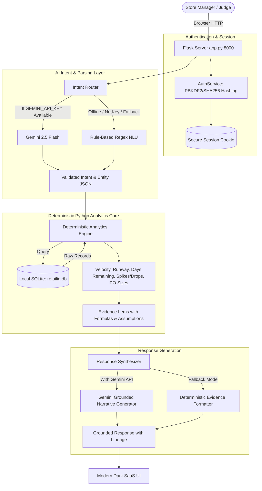

TRACK_ID=PS03
# RetailIQ — AI-Powered Sales & Inventory Copilot

> **"Turn retail data into decisions."**  
> *Official Hackathon Submission for NexusTiQ24 — Track PS03: Retail: Sales and Inventory Copilot*

RetailIQ is an enterprise-grade AI copilot and executive analytics platform for retail store managers. The system couples **deterministic Python analytics** with **Google Gemini (the only external API allowed)** under a strict **No-Hallucination Policy**. All sales, inventory, velocity calculations, and database queries execute 100% locally and deterministically using Python, SQLite, and Pandas.

---

## 1. Project Name & Track
- **Project Name**: RetailIQ — AI-Powered Sales & Inventory Copilot
- **Hackathon**: NexusTiQ24
- **Track ID**: PS03 — Retail: Sales and Inventory Copilot
- **Default Port**: `http://localhost:8000`
- **Execution Command**: `python app.py`

---

## 2. Problem Statement
Small-to-medium retail operations managing multi-store footprints frequently struggle with inventory misalignment:
- **Silent Stockouts**: High-velocity products deplete before replenishment orders can be dispatched, causing lost revenue and customer churn.
- **Tied-up Working Capital**: Excess inventory sits idle on shelves for slow-moving products without automated alerts.
- **Information Overload**: Store managers lack time to run manual SQL queries to track demand shifts across dozens of SKUs and regional locations.
- **LLM Hallucination Risk**: Standard chatbots invent fake inventory counts, fabricate delivery dates, and cannot cite mathematical formulas.

---

## 3. The Solution
RetailIQ solves this directly by implementing a **Two-Tier Architecture**:
1. **Deterministic Python Mathematical Core**: Python and local SQLite calculate exact metrics — days remaining, velocity ratios, stockout risks, overstocks, and reorder quantities.
2. **Grounded Gemini NLU & Summarization**: Gemini 2.5 Flash understands natural language queries, classifies managerial intent, and synthesizes structured evidence into actionable business explanations without hallucinating numbers.
3. **Strict Restraint Guardrails**: When asked questions outside the dataset boundary (such as live supplier GPS tracking), RetailIQ refuses to guess and clearly explains what data is missing.
4. **Resilient Dual-Mode Execution**: If `GEMINI_API_KEY` is not provided or network is down, RetailIQ runs automatically in Verified Deterministic Fallback Mode with zero downtime.

---

## 4. PS03 Track Requirements Compliance

| PS03 Requirement | Implementation in RetailIQ | Verification |
| :--- | :--- | :--- |
| **Working Application** | Pure Python 3.11 + Flask + SQLite serving `http://localhost:8000`. | Tested via `python app.py` |
| **Only External API: Gemini** | Only Google GenAI SDK used (`google-genai`). No OpenAI, Claude, Pinecone, etc. | Verified in dependencies & code |
| **API Key via `GEMINI_API_KEY`** | Loaded strictly via environment variable `os.getenv("GEMINI_API_KEY")`. | No hardcoded secrets |
| **Deterministic Source of Truth** | Python calculations for revenue, runway, velocity, reorders, spikes/drops. | Tested in `tests/test_retailiq.py` |
| **Grounded GenAI & Evidence** | Every Copilot answer provides evidence tables with formula, range, and tables. | Tested across all 14 intents |
| **Operational Restraint** | Safe handling of unsupported queries (e.g. supplier delivery tomorrow). | Tested via automated test suite |
| **Human-in-the-Loop** | Generates draft reorders for manager approval; no false supplier claims. | Tested via `/recommendations` |
| **Real User Data Entry** | Users can add their own stores, products, inventory, sales, or upload CSV. | Tested via forms and API |
| **Non-Overlapping Layout** | Rigid flexbox sidebar (`260px; flex-shrink: 0; sticky`) + centered content. | Tested across viewports |
| **Isolated Auth** | Independent `/login` and `/register` cards, no dashboard sidebar. | Tested via E2E test suite |

---

## 5. Application Architecture



---

## 6. AI Architecture & Grounding Lineage
- **SDK**: Official Google GenAI SDK (`google-genai==2.22.0`).
- **Models**:
  - `gemini-2.5-flash` / `gemini-3.7-flash` for high-speed intent extraction and natural executive summaries.
  - `gemini-embedding-001` for vector representations.
- **Evidence Structure**:
  Every Copilot response returns structured grounding metadata:
  ```json
  {
    "metric": "Estimated Runway (Wireless Optical Mouse)",
    "value": "4.3 days (18 units / 4.2 units/day)",
    "source_table": "inventory, sales",
    "date_range": "Previous 30 days ending 2026-09-04",
    "calculation": "days_remaining = current_stock / avg_daily_sales",
    "assumptions": [
      "Demand continues at 4.2 units/day baseline velocity.",
      "Supplier lead time is 5 days."
    ]
  }
  ```

---

## 7. Deterministic Business Rules (`src/config.py`)
All business thresholds are centralized, transparent, and configurable:
- `BASELINE_DAYS = 30`: Historical baseline window for calculating average daily sales velocity.
- `RECENT_WINDOW_DAYS = 7`: Recent window for detecting sales velocity anomalies.
- `SAFETY_STOCK_BUFFER_DAYS = 2`: Safety buffer added to replenishment lead time.
- `OVERSTOCK_DAYS_THRESHOLD = 60`: Flagged when days of supply exceed 60 days.
- `SLOW_MOVING_VELOCITY_THRESHOLD = 0.25`: Units per day threshold for slow-moving items.
- `SALES_SPIKE_RATIO = 1.50`: Recent velocity $\ge 1.50\times$ baseline velocity.
- `SALES_DROP_RATIO = 0.60`: Recent velocity $\le 0.60\times$ baseline velocity.
- `REORDER_TARGET_DAYS = 21`: Buffer stock cycle for purchase order recommendations.

---

## 8. Data Model & Database Schema
Stored locally in `data/retailiq.db` (SQLite with WAL mode, foreign keys, and indexes):
1. **`users`**: Store managers (`user_id`, `full_name`, `email`, `password_hash`, `business_name`, `created_at`).
2. **`stores`**: Physical retail branches (`store_id`, `code`, `name`, `city`, `address`, `manager_name`, `contact_phone`, `is_demo`, `user_id`).
3. **`categories`**: Product categories (`category_id`, `code`, `name`, `description`, `target_turnover_days`).
4. **`products`**: Product catalog (`product_id`, `sku`, `name`, `cost_price`, `selling_price`, `supplier_name`, `lead_time_days`, `min_reorder_qty`, `is_demo`, `user_id`).
5. **`inventory`**: Store product balances (`inventory_id`, `store_id`, `product_id`, `current_stock`, `reorder_level`, `safety_stock`, `last_restock_date`, `is_demo`, `user_id`).
6. **`sales`**: POS daily sales transactions (`sale_id`, `date`, `store_id`, `product_id`, `units_sold`, `unit_price`, `revenue`, `cost`, `profit`, `is_demo`, `user_id`).
7. **`reorder_requests`**: Human-in-the-loop draft replenishment register (`request_id`, `store_id`, `product_id`, `quantity`, `estimated_cost`, `urgency`, `status`, `created_at`, `notes`).
8. **`audit_logs`**: Immutable security and activity event log (`log_id`, `timestamp`, `user_email`, `action`, `details`, `ip_address`).

---

## 9. Generated Demo Data & Deliberate Showcase Scenarios
The database comes pre-seeded with 6 months of coherent retail data (March 1, 2026 – September 4, 2026) across 4 stores and 50 products:
- **Stockout Risk Showcase**: *Wireless Optical Mouse* (SKU-EL-002) at Chennai Central:
  - 18 units in stock, velocity of 4.2 units/day $\rightarrow$ **4.3 days remaining** vs 5-day supplier lead time.
- **Overstock Showcase**: *Ergonomic Desk Mat* (SKU-AC-015) at Karur Main:
  - 350 units in stock, velocity of 0.8 units/day $\rightarrow$ **437 days of supply** (₹1.12L locked capital).
- **Slow Moving Showcase**: *Premium Calligraphy Pen* (SKU-ST-035) at Salem Junction:
  - 0.1 units/day velocity with 45 stagnant units.
- **Sales Spike Showcase**: *Noise Cancelling Earbuds* (SKU-EL-003) at Coimbatore Mall:
  - Velocity surged from 2.1 to 6.8 units/day (+224% increase in last 7 days).
- **Sales Drop Showcase**: *Stainless Steel Insulated Flask* (SKU-HM-022) at Chennai Central:
  - Velocity slumped from 5.5 to 1.8 units/day (-67% decline in last 14 days).

---

## 10. User-Entered Data & Data Isolation
RetailIQ is not a static demo. Users can create accounts and enter their own:
- Stores (`/stores`)
- Products (`/products`)
- Inventory stock counts (`/inventory`)
- Sales transactions (`/sales`)
- Bulk CSV files (`/data-explorer`)

The **Data Mode Switcher** in the topbar lets managers toggle between:
- **Demo Data**: Evaluates the clean, pre-seeded 6-month hackathon dataset.
- **My Entered Data**: Shows only records created by the logged-in user.
- **All Combined**: Aggregates demo and user data seamlessly.

---

## 11. Human-in-the-Loop Safeguards
RetailIQ explicitly avoids claiming capabilities that require external infrastructure:
- When a replenishment recommendation is generated, it creates an internal **Draft Reorder Request** in SQLite for manager sign-off.
- The UI clearly states: *"RetailIQ calculates optimal mathematical reorder quantities and records internal draft orders. Since external supplier ERP/EDI integrations are outside the local system boundary, RetailIQ does not claim to dispatch external orders or falsify supplier commitments."*
- Managers can review, adjust, and mark orders as `Approved`.

---

## 12. Difficult-Case Demonstration (Restraint & No Hallucination)
To verify that RetailIQ does not invent facts:
1. Open `/copilot`.
2. Click the prompt chip: **`"Will the supplier deliver tomorrow?"`**
3. **RetailIQ's Grounded Response**:
   > *"I cannot determine that from the available data. The RetailIQ dataset contains historical sales transactions, catalog pricing, and physical inventory stock levels for our 4 stores, but does not track external variables such as live supplier delivery tracking or truck GPS telemetry."*
4. It suggests integrating live supplier dispatch webhooks rather than hallucinating delivery schedules.

---

## 13. Setup & Running Instructions

### Prerequisites
- Python 3.10 or Python 3.11

### Step 1: Install Dependencies
```bash
pip install -r requirements.txt
```

### Step 2: Configure Environment (Optional)
Copy `.env.example` to `.env` if using a live Gemini API key:
```bash
cp .env.example .env
```
Add your key:
```text
GEMINI_API_KEY=your_actual_gemini_api_key_here
```
*(Note: If omitted, RetailIQ automatically runs in Verified Deterministic Fallback Mode with full analytical functionality).*

### Step 3: Start the Application
```bash
python app.py
```

### Step 4: Open in Chrome
Navigate to:
```text
http://localhost:8000
```

---

## 14. 2-Minute Demo Flow for Hackathon Judges

1. **Login Page (`/login`)**:
   - Open `http://localhost:8000`. You are redirected to `/login`.
   - Click **`🚀 1-Click Demo Manager Login`** to sign in immediately without typing.
2. **Dashboard (`/dashboard`)**:
   - Inspect the 6 KPI cards, 4 live Chart.js charts (Sales Trend, Store Comparison, Category Breakdown, Inventory Health), and Critical Operations Alert Summary.
   - Confirm the sidebar does **not** cover any content; all cards and charts are centered in the 1400px container.
3. **AI Copilot (`/copilot`)**:
   - Click **`🚨 Which products are at risk of stockout?`**. Notice the exact stock runway (4.3 days) and recommended reorder for Wireless Mouse at Chennai Central.
   - Click **`⚠️ Will the supplier deliver tomorrow?`**. Notice the strict operational restraint.
4. **Inventory Health (`/inventory`)**:
   - Filter by **Critical Stockout** to see the Mouse at Chennai Central.
   - Click **`+ Add / Update Stock`** to update any SKU count.
5. **Products Master (`/products`)**:
   - Inspect unit costs, selling prices, and gross margins across 50 SKUs. Click **`+ Add New Product`**.
6. **Stores Network (`/stores`)**:
   - View revenue, profit, and stock valuation breakdown for Chennai, Karur, Coimbatore, and Salem.
7. **Sales POS (`/sales`)**:
   - Click **`+ Record New Sale`** to enter a transaction. Observe immediate reactivity in analytics.
8. **Alerts (`/alerts`)**:
   - Filter alerts by severity (Critical, Warning, Info) and click **`+ Create Draft Reorder`**.
9. **Recommendations (`/recommendations`)**:
   - Inspect grounded reorder formulas, HITL notice, and approve draft reorders.
10. **Data Explorer (`/data-explorer`)**:
    - Inspect raw SQLite tables and test the Bulk CSV Ingestion tool.
11. **Logout (`/logout`)**:
    - Click Logout in the sidebar to verify session clearance and login redirect.

---

## 15. Technology Stack
- **Backend**: Python 3.10 / 3.11, Flask 3.1, Pandas 2.3, NumPy 2.2, Pydantic 2.13, Werkzeug 3.1
- **AI Integration**: Google GenAI SDK (`google-genai`), Gemini 2.5 Flash, Gemini Embeddings
- **Database**: SQLite 3 (WAL mode, foreign key enforcement, custom composite indexes)
- **Frontend**: Responsive Modern Dark SaaS UI, CSS Grid & Flexbox, Chart.js 4.4, Vanilla JavaScript
- **No Node/NPM**: Single terminal command `python app.py` starts the complete application.

---

## 16. Limitations
- Single-node SQLite database (ideal for local store operations and hackathon evaluation).
- External logistics telemetry is simulated via supplier lead times rather than live carrier APIs.

---

## 17. Demo Video Link
`DEMO VIDEO: [LINK_PLACEHOLDER - Recorded walkthrough available upon request]`
